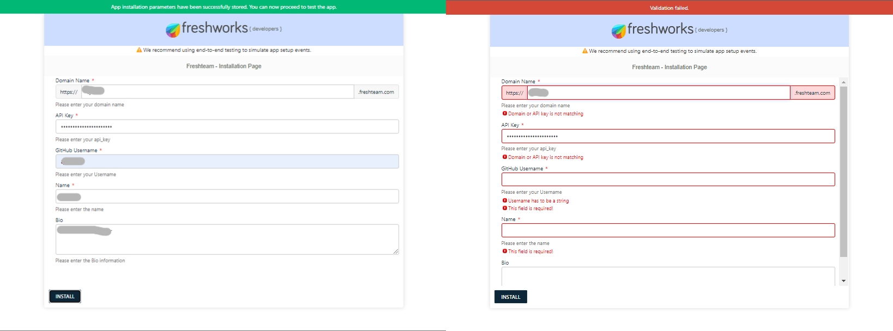

# Dynamic Installation Page ✨

## Description

This sample app demonstrates how iparam callbacks can be used to enable custom validation and make the installation parameters much more dynamic. This approach cuts the need for custom installation parameters and leverages the simplicity and power of standard iparams (iparams.json).

## Screenshots

## Features Demonstrated

App location: Job Details Page

|                                                      Feature                                                       | Notes                                                                        |
| :----------------------------------------------------------------------------------------------------------------: | ---------------------------------------------------------------------------- |
|                     [`Request methods`](https://developers.freshteam.com/docs/request-method/)                     | Request API is used to facilitate third-party REST API calls from iparams.js |
| [`iparam utility methods`](https://developers.freshteam.com/docs/installation-parameters/#dynamic_install_page) | Utility methods facilitate iparam field manipulation                         |

## Prerequisites

1. Make sure you have a trial Freshteam account created
2. Ensure that you have the [FDK (Freshworks Development Kit)](https://developers.freshteam.com/docs/freshworks-cli/) installed properly.

## Procedure to run the app

1. Run the app locally using the [`fdk run`](https://developers.freshteam.com/docs/freshworks-cli/#run) command.
2. Go to `http://localhost:10001/custom_configs` in your browser to test the installation page.
3. You can add new callback functions associated with iparam fields in `iparams.json` by specifying the callback name & in `iparams.js`by defining the corresponding callback function.
4. You can also modify the code directly in the `iparams.js` file to see the changes in the Installation pages.

