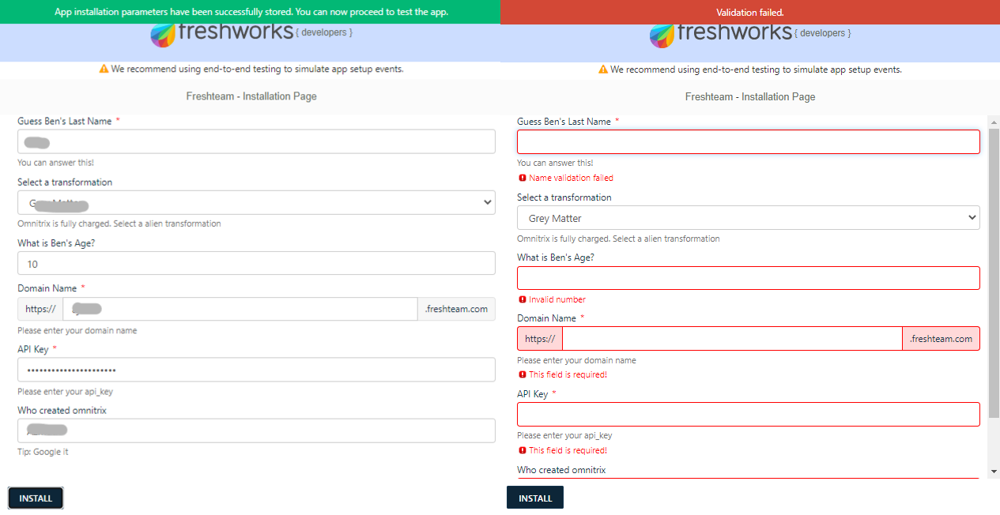

# Config app for Freshteam ✨

## Description

This sample app demonstrates how `iparams.json` is a easy way for freshworks developers to implement the configuration code by writing as less source-code as possible. See `config/` and get started using it in your apps!

## Screenshots

## Features Demonstrated

App location: Job Details Page

| Features         | Notes                                                                                |
| ---------------- | ------------------------------------------------------------------------------------ |
| _`iparams.json`_ | app uses [Ben 10](https://en.wikipedia.org/wiki/Ben_10) as fun context               |
| App manifest     | The manifest.json file contains information such as the platform version used by a product, locations on the product UI, SMI functions, events, the Node.js and FDK versions used to build, test, validate, and pack the app, and third-party domains with which the app can interact.  |

## Prerequisites

1. Make sure you have a trial Freshteam account created
2. Ensure that you have the [FDK (Freshworks Development Kit)](https://developers.freshteam.com/docs/freshworks-cli/) installed properly.

## Procedure to run the app

1. Run the app locally using the [`fdk run`](https://developers.freshteam.com/docs/freshworks-cli/#run) command.
2. Go to `http://localhost:10001/custom_configs` in your browser to test the installation page.
3. You can add new callback functions associated with iparam fields in `iparams.json` by specifying the callback name & in `iparams.js`by defining the corresponding callback function.
4. You can also modify the code directly in the `iparams.js` file to see the changes in the Installation pages.
